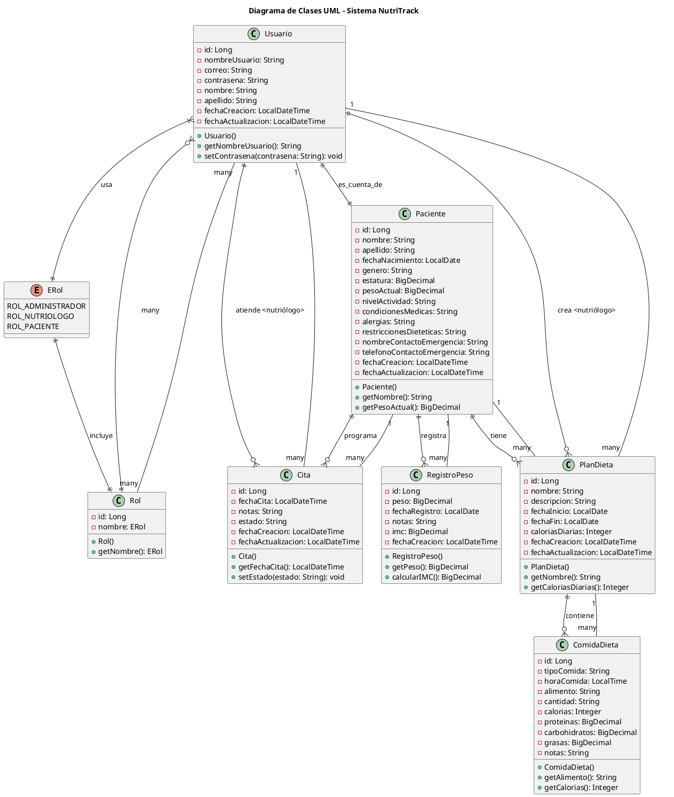

# Diagrama de Clases UML - Sistema NutriTrack

## Descripción del Proyecto

**NutriTrack** es un sistema integral de gestión nutricional desarrollado con Spring Boot (backend) y Vue.js (frontend), diseñado para optimizar el trabajo de profesionales nutriólogos y mejorar el seguimiento de pacientes.

## Arquitectura del Sistema

- **Backend**: Spring Boot 3.5.0 con Java 17
- **Frontend**: Vue.js 3 con Vuetify UI
- **Base de Datos**: H2 Database (embebida)
- **Autenticación**: JWT (JSON Web Tokens)
- **Herramientas**: Maven, Vite, Visual Studio Code

## Código PlantUML del Diagrama

## Entidades del Sistema

### 1. **Usuario**
- Entidad central del sistema de autenticación
- Almacena credenciales y datos básicos
- Relacionado con roles para control de acceso

### 2. **Rol y ERol**
- Sistema de roles basado en enum
- Tres tipos: Administrador, Nutriólogo, Paciente
- Permite control de acceso granular

### 3. **Paciente**
- Perfil completo del paciente
- Datos médicos y de contacto
- Vinculado a un usuario del sistema

### 4. **Cita**
- Gestión de citas entre nutriólogo y paciente
- Control de estados y notas
- Trazabilidad completa

### 5. **RegistroPeso**
- Historial de peso del paciente
- Cálculo automático de IMC
- Seguimiento temporal

### 6. **PlanDieta**
- Planes nutricionales personalizados
- Rango de fechas y objetivos calóricos
- Creado por nutriólogos

### 7. **ComidaDieta**
- Detalle de comidas individuales
- Información nutricional completa
- Horarios y cantidades específicas

## Características Técnicas

- **Patrón MVC**: Separación clara de responsabilidades
- **JPA/Hibernate**: Mapeo objeto-relacional
- **Spring Security**: Autenticación y autorización
- **Validaciones**: Bean Validation (JSR-303)
- **Auditoría**: Timestamps automáticos
- **Relaciones**: OneToOne, OneToMany, ManyToMany

## Funcionalidades Principales

1. **Gestión de Usuarios y Roles**
2. **Registro y Seguimiento de Pacientes**
3. **Programación de Citas**
4. **Planes Dietéticos Personalizados**
5. **Seguimiento de Peso e IMC**
6. **Reportes y Análisis**

---

**Desarrollado por**: Carlo  
**Fecha**: Octubre 2025  
**Tecnologías**: Spring Boot 3.5.0, Vue.js 3, H2 Database, Maven, Vite  
**IDE**: Visual Studio Code